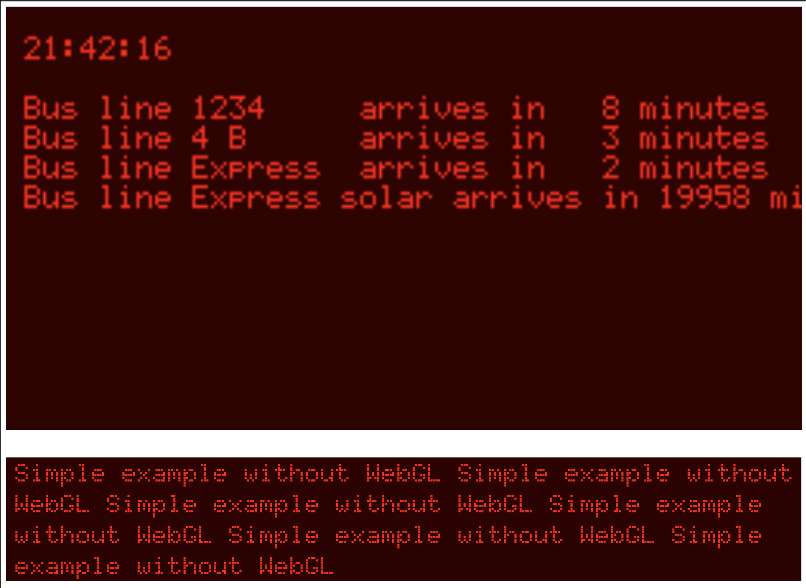

# WebGL example for a LED Display

This is a WebGL example to simulate any size of a LED Display.




## Start

In VisualCode or Cursor start the "Live Server" and go to http://127.0.0.1:5500/index.html

## Stop Server

In commandline (Shift + Apple + P or Shift + Ctrl + P) find "Stop Live Server" and execute.

## Fonts 

The Doto fonts are from https://fonts.google.com/?categoryFilters=Appearance:%2FTheme%2FPixel

Put them into "/font/" and update the /font/.../*.ttf links in index.html or/and matrix-font.css accordingly

For legal reasons I did not add them here.

## size

The number of LED'S can ge set in the first lines of main.js


## blur

You can fine tune the blur in main.js

```js:main.js
//Light blur
    vec2 texelSize = vec2(0.1) / vec2(textureSize(uTexture, 0));
//Strong blur
    vec2 texelSize = vec2(0.5) / vec2(textureSize(uTexture, 0));
```

## CORS

If you need to use the temporary CORS-Proxy and you get a json parsing error at 1,1 , go to 

https://cors-anywhere.herokuapp.com/corsdemo

and press the button there.

## TODO

- Pimp the LEDs (Color, size, gap, shape, ...) and make this settings available in a professional way
- Reduce power consumption of WebGL (lower fps maybe?)
- Add examples for some (open) api endpoints and make a small node server for that, too.
- Make an interface to a real LED display (Send me one and maybe I'll do it :-) )

## License

This project is licensed under the Creative Commons Attribution-NonCommercial 4.0 International License.

This means you can:
- Use this project for non-commercial purposes
- Modify and adapt the code
- Share the code with others

You must:
- Provide attribution to the original creator 
- Provide a link to the git hub repository
- Not use the project for commercial purposes

For more details, see the [LICENSE](LICENSE) file.
